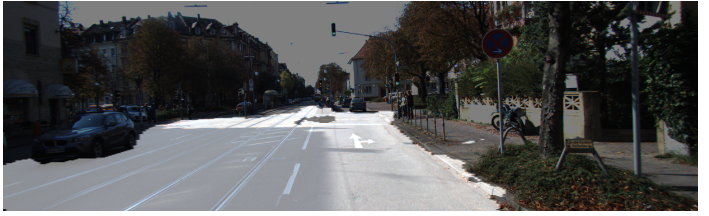
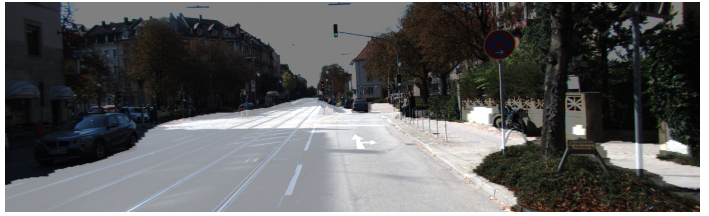
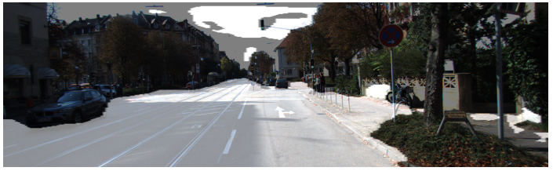
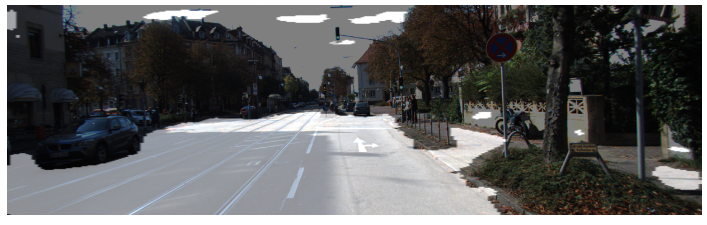
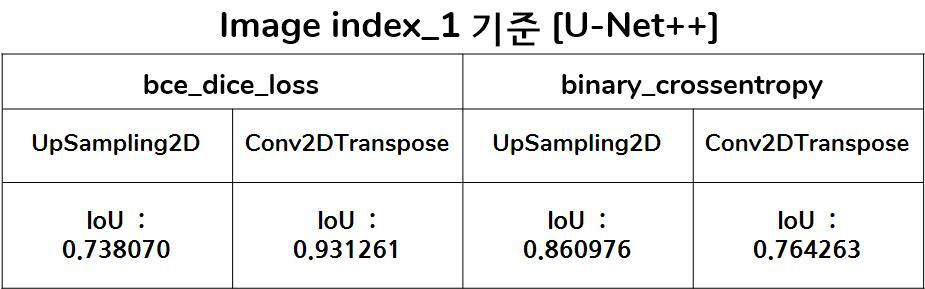
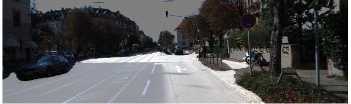
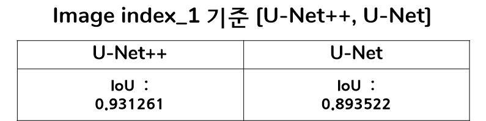

# U-Net, U-Net++ model implementation and comparison
- **using KITTI dataset**

The purpose of the project is to compare the IoU of U-Net, U-Net++ models.  

In addition, U-Net++ will compare two more elements:
1. Compare Up-Sampling 2D() and Conv2Dtranspose() methods of image Up-Sampling

2. Compare binary_crossentropy and bce_dice_loss[custom loss function]

----
해당 git 노트북의 목적은 U-Net과 U-Net++ 각 모델의 IoU 비교입니다.       
추가로, U-Net++은 다음 2가지에 대해서도 비교를 진행합니다.  

1. Upsampling하는 2가지 방법인 UpSampling2D()와 Conv2DTranspose() 비교  

2. keras에서 제공되는 loss인 binary_crossentropy와 custom loss인 bce_dice_loss 비교   

## Semantic Segmentation [U-Net++]
각 모델의 결과는 다음과 같습니다.   

### Conv2DTranspose + bce_dice_loss 

- **index_1 IoU : 0.931261**

 

---

### Conv2DTranspose + binary_crossentropy

- **index_1 IoU : 0.764263**

 

---

### UpSampling2D + bce_dice_loss

- **index_1 IoU : 0.738070**

 

---

### UpSampling2D + binary_crossentropy

- **index_1 IoU : 0.860976**

 

---

  
위의 결과를 표로 나타내면 다음과 같습니다.   

### Nested U-Net 

---

## Semantic Segmentation [U-Net]

- **index_1 IoU : 0.893522** 

 

---

## U-Net vs U-Net++ 

- **U-Net++**의 결과가 더 좋은것을 확인할 수 있습니다.   

---

### References
- **[Nested U-Net author blog](https://sh-tsang.medium.com/review-unet-a-nested-u-net-architecture-biomedical-image-segmentation-57be56859b20)**
